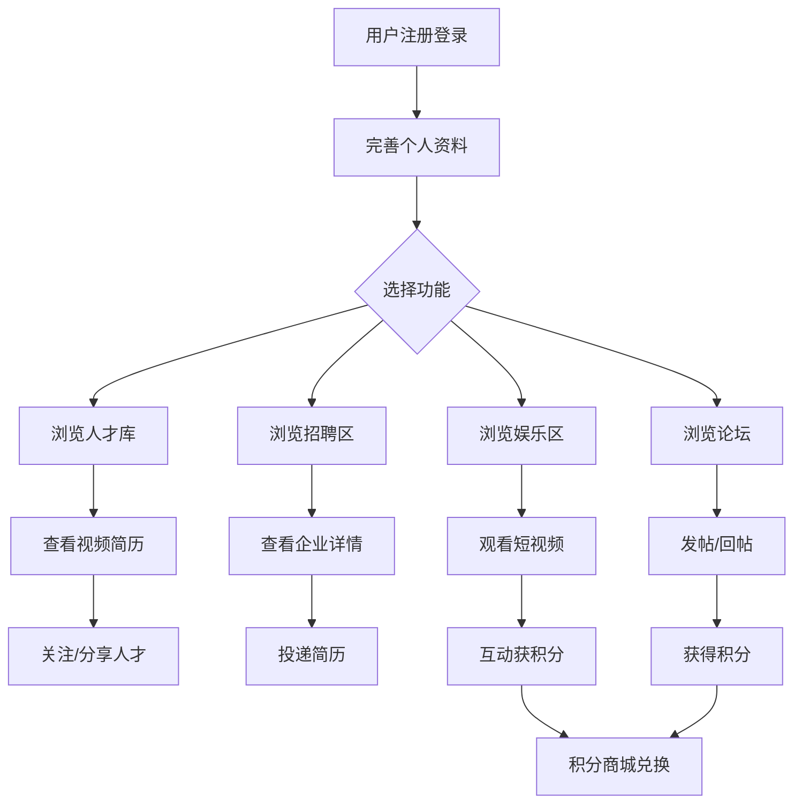

## 1. Product Overview
新泰优聘人才社区 - 新泰人的职业生活社区，集人才展示、企业招聘、职场娱乐、社区交流于一体的综合性职业服务平台。
- 为新泰本地求职者提供真实可信的求职渠道，为企业提供优质人才资源
- 通过娱乐化内容增强用户粘性，打造新泰本地最具影响力的职业生活社区

## 2. Core Features

### 2.1 User Roles
| Role | Registration Method | Core Permissions |
|------|---------------------|------------------|
| 求职者 | 手机号/微信注册 | 发布简历、投递职位、浏览招聘、参与社区讨论 |
| 企业HR | 企业资质认证 | 发布职位、查看简历、管理招聘流程 |
| 普通用户 | 手机号/微信注册 | 浏览内容、参与互动、观看直播 |
| 管理员 | 后台分配 | 审核内容、管理用户、数据统计 |

### 2.2 Feature Module
1. **首页**: 导航入口、推荐内容、热门招聘、急招专区
2. **人才区-新泰人才库**: 视频简历库、人才分类导航、人才认证体系、急找工作专区、人才直播间
3. **招聘区-新泰好工作**: 企业视频展示、智能匹配系统、招聘企业分层、薪资透明计划、企业口碑系统
4. **娱乐区-新泰职场圈**: 短视频内容聚合、互动娱乐功能、积分娱乐系统
5. **求职论坛-新泰职友说**: 企业讨论区、问答求助区、同城交友区、官方公告区

### 2.3 Page Details

| Page Name | Module Name | Feature description |
|-----------|-------------|---------------------|
| 首页 | Hero Banner | 轮播展示热门内容、急招岗位、活动推广 |
| 首页 | 导航入口 | 四大版块快捷入口，底部固定导航栏 |
| 首页 | 推荐内容 | 智能推荐招聘岗位、人才、热门帖子 |
| 人才库 | 视频简历列表 | 展示求职者30-60秒自我介绍视频，支持筛选 |
| 人才库 | 人才分类导航 | 按岗位/行业/区域分类筛选人才 |
| 人才库 | 人才认证标识 | 实名认证、技能认证、靠谱人才标签展示 |
| 人才库 | 急找工作专区 | 48小时内急需工作的人才优先展示 |
| 人才库 | 人才直播间 | 定时开放在线面试直播，支持预约 |
| 招聘区 | 企业视频展示 | 食堂/车间/宿舍实拍，团队文化介绍 |
| 招聘区 | 智能匹配 | 输入期望薪资/地点/岗位类型，智能推荐 |
| 招聘区 | 企业分层 | 急招专区、认证企业、明星雇主、新厂专区 |
| 招聘区 | 企业口碑 | 在职/离职员工匿名评价展示 |
| 娱乐区 | 短视频聚合 | 同步抖音/视频号内容，按标签分类 |
| 娱乐区 | 互动功能 | 职场话题PK、薪资投票、企业人气榜 |
| 娱乐区 | 积分系统 | 签到、看视频、发帖获积分，积分兑换 |
| 论坛 | 企业讨论区 | 每个企业专属讨论版，匿名分享体验 |
| 论坛 | 问答求助区 | 快速提问、HR专家答疑、劳务避坑指南 |
| 论坛 | 同城交友区 | 找饭搭子、拼车上下班、同城活动 |
| 论坛 | 官方公告区 | 招聘会信息、政策解读、平台活动通知 |
| 用户中心 | 个人资料 | 编辑个人信息、视频简历管理 |
| 用户中心 | 求职记录 | 投递记录、面试安排、入职跟踪 |
| 用户中心 | 积分商城 | 积分兑换面试车费补贴、奶茶券、电影票 |

## 3. Core Process

### 3.1 求职流程
求职者注册登录 → 完善简历（上传视频简历）→ 浏览招聘岗位 → 智能匹配推荐 → 投递简历 → 面试邀请 → 面试 → 入职 → 分享入职体验

### 3.2 招聘流程
企业注册认证 → 完善企业信息（上传视频展示）→ 发布职位 → 浏览人才 → 发送面试邀请 → 面试 → 录用

### 3.3 互动流程
用户浏览内容 → 点赞/评论/分享 → 获得积分 → 积分兑换礼品 → 参与活动 → 获得更多积分

## 4. User Interface Design

### 4.1 Design Style
- **主色调**: 活力橙 (#FF6B35) - 代表热情、活力、职业发展
- **辅助色**: 科技蓝 (#1E90FF) - 代表专业、信任、企业
- **中性色**: 深灰 (#333333)、中灰 (#666666)、浅灰 (#EEEEEE)
- **按钮风格**: 圆角矩形，主按钮渐变橙色，悬停有阴影效果
- **字体**: 标题使用"思源黑体 Bold"，正文使用"思源黑体 Regular"
- **布局风格**: 卡片式布局，清晰的信息层级，现代化设计
- **图标风格**: 使用Lucide图标库，线条简洁现代

### 4.2 Page Design Overview

| Page Name | Module Name | UI Elements |
|-----------|-------------|-------------|
| 首页 | Hero Banner | 全屏轮播，渐变背景，动态文字效果 |
| 首页 | 导航入口 | 四个大卡片，图标+文字，悬停放大效果 |
| 首页 | 推荐内容 | 横向滚动卡片列表，卡片包含图片、标题、标签 |
| 人才库 | 视频简历列表 | 视频缩略图卡片，播放按钮覆盖层，认证标识标签 |
| 人才库 | 分类导航 | 横向标签栏，选中状态高亮，支持滑动 |
| 招聘区 | 企业卡片 | 企业logo、名称、星级评分、薪资范围、地点 |
| 招聘区 | 视频展示区 | 视频播放器，多个视频切换标签 |
| 娱乐区 | 短视频流 | 瀑布流布局，视频卡片包含封面、播放量、点赞数 |
| 论坛 | 帖子列表 | 帖子卡片，包含头像、标题、内容预览、互动数据 |
| 用户中心 | 侧边导航 | 垂直导航栏，图标+文字，选中状态高亮 |

### 4.3 Responsiveness
- **Desktop-first**: 1200px+ 桌面端完整功能展示
- **Tablet**: 768px-1199px 自适应布局，部分模块堆叠
- **Mobile**: 320px-767px 单列布局，底部固定导航栏，触摸优化

### 4.4 Animation Effects
- 页面加载时元素渐入动画
- 卡片悬停时缩放+阴影效果
- 视频播放按钮脉冲动画
- 标签切换滑动过渡
- 滚动时导航栏背景变化