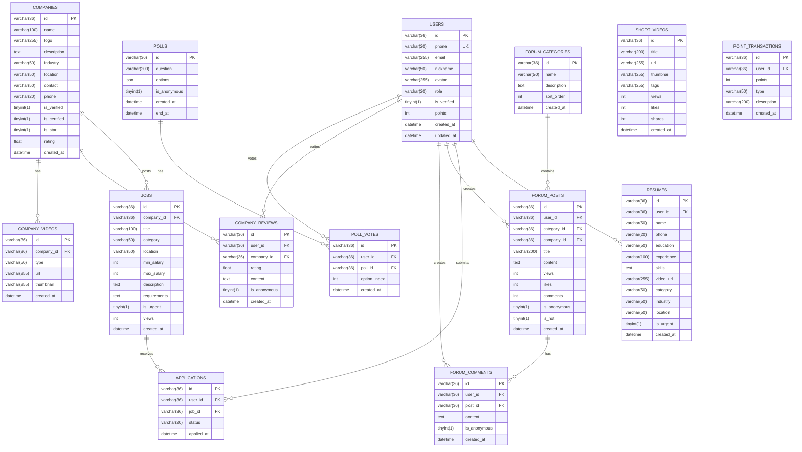

## 1. Architecture Design

```mermaid
layeredGraph LR
    subgraph Frontend
        F1[React Components]
        F2[State Management]
        F3[Routing]
        F4[UI Library]
    end
    subgraph Backend
        B1[Express API]
        B2[MySQL Database]
        B3[JWT Auth]
        B4[File Storage]
    end
    subgraph External Services
        E1[抖音/视频号 API]
        E2[短信服务]
        E3[支付服务]
    end
    Frontend --> Backend
    Backend --> External Services
```

## 2. Technology Description

* Frontend: React\@18 + TypeScript + TailwindCSS\@3 + Vite\@6

* State Management: Zustand

* Routing: React Router DOM\@6

* UI Icons: Lucide React

* Animation: Framer Motion

* Backend: Express\@4 + MySQL\@8 + JWT Authentication

* Database: MySQL 8.0+

* ORM: Prisma / mysql2

* Video Player: Video.js / React Player

## 3. Route Definitions

| Route               | Purpose        |
| ------------------- | -------------- |
| /                   | 首页，展示推荐内容和导航入口 |
| /talent             | 人才库首页，视频简历列表   |
| /talent/detail/:id  | 人才详情页          |
| /talent/live        | 人才直播间          |
| /jobs               | 招聘区首页，岗位列表     |
| /jobs/detail/:id    | 职位详情页          |
| /jobs/company/:id   | 企业详情页          |
| /entertainment      | 娱乐区首页，短视频内容    |
| /forum              | 论坛首页           |
| /forum/category/:id | 论坛分类页          |
| /forum/post/:id     | 帖子详情页          |
| /forum/company/:id  | 企业讨论版          |
| /user/profile       | 用户个人中心         |
| /user/resume        | 简历管理           |
| /user/jobs          | 求职记录           |
| /user/points        | 积分商城           |
| /login              | 登录页面           |
| /register           | 注册页面           |

## 4. API Definitions

### 4.1 User APIs

| Method | Endpoint           | Description |
| ------ | ------------------ | ----------- |
| POST   | /api/auth/login    | 用户登录        |
| POST   | /api/auth/register | 用户注册        |
| GET    | /api/user/profile  | 获取用户信息      |
| PUT    | /api/user/profile  | 更新用户信息      |
| GET    | /api/user/points   | 获取积分余额      |

### 4.2 Talent APIs

| Method | Endpoint           | Description |
| ------ | ------------------ | ----------- |
| GET    | /api/talent        | 获取人才列表      |
| GET    | /api/talent/:id    | 获取人才详情      |
| POST   | /api/talent        | 创建人才档案      |
| PUT    | /api/talent/:id    | 更新人才档案      |
| GET    | /api/talent/urgent | 获取急找工作人才    |

### 4.3 Job APIs

| Method | Endpoint            | Description |
| ------ | ------------------- | ----------- |
| GET    | /api/jobs           | 获取岗位列表      |
| GET    | /api/jobs/:id       | 获取岗位详情      |
| POST   | /api/jobs           | 发布岗位        |
| POST   | /api/jobs/apply     | 投递简历        |
| GET    | /api/jobs/recommend | 智能推荐岗位      |

### 4.4 Company APIs

| Method | Endpoint               | Description |
| ------ | ---------------------- | ----------- |
| GET    | /api/companies         | 获取企业列表      |
| GET    | /api/companies/:id     | 获取企业详情      |
| POST   | /api/companies         | 创建企业        |
| GET    | /api/companies/reviews | 获取企业评价      |

### 4.5 Forum APIs

| Method | Endpoint              | Description |
| ------ | --------------------- | ----------- |
| GET    | /api/forum/categories | 获取论坛分类      |
| GET    | /api/forum/posts      | 获取帖子列表      |
| GET    | /api/forum/posts/:id  | 获取帖子详情      |
| POST   | /api/forum/posts      | 发布帖子        |
| POST   | /api/forum/comments   | 发布评论        |

### 4.6 Entertainment APIs

| Method | Endpoint         | Description |
| ------ | ---------------- | ----------- |
| GET    | /api/shortvideos | 获取短视频列表     |
| GET    | /api/polls       | 获取投票列表      |
| POST   | /api/polls/vote  | 参与投票        |

## 5. Data Model

### 5.1 Data Model Definition



### 5.2 Data Definition Language

```sql
CREATE DATABASE IF NOT EXISTS xintai_recruitment DEFAULT CHARACTER SET utf8mb4 COLLATE utf8mb4_unicode_ci;

USE xintai_recruitment;

CREATE TABLE users (
    id VARCHAR(36) PRIMARY KEY DEFAULT UUID(),
    phone VARCHAR(20) UNIQUE NOT NULL,
    email VARCHAR(255),
    nickname VARCHAR(50) NOT NULL,
    avatar VARCHAR(255),
    role VARCHAR(20) DEFAULT 'user',
    is_verified TINYINT(1) DEFAULT 0,
    points INT DEFAULT 0,
    password VARCHAR(255) NOT NULL,
    created_at DATETIME DEFAULT CURRENT_TIMESTAMP,
    updated_at DATETIME DEFAULT CURRENT_TIMESTAMP ON UPDATE CURRENT_TIMESTAMP
);

CREATE TABLE resumes (
    id VARCHAR(36) PRIMARY KEY DEFAULT UUID(),
    user_id VARCHAR(36) NOT NULL,
    name VARCHAR(50) NOT NULL,
    phone VARCHAR(20) NOT NULL,
    education VARCHAR(50),
    experience VARCHAR(100),
    skills TEXT,
    video_url VARCHAR(255),
    category VARCHAR(50),
    industry VARCHAR(50),
    location VARCHAR(50),
    is_urgent TINYINT(1) DEFAULT 0,
    created_at DATETIME DEFAULT CURRENT_TIMESTAMP,
    FOREIGN KEY (user_id) REFERENCES users(id) ON DELETE CASCADE
);

CREATE TABLE companies (
    id VARCHAR(36) PRIMARY KEY DEFAULT UUID(),
    name VARCHAR(100) NOT NULL,
    logo VARCHAR(255),
    description TEXT,
    industry VARCHAR(50),
    location VARCHAR(50),
    contact VARCHAR(50),
    phone VARCHAR(20),
    is_verified TINYINT(1) DEFAULT 0,
    is_certified TINYINT(1) DEFAULT 0,
    is_star TINYINT(1) DEFAULT 0,
    rating FLOAT DEFAULT 0,
    created_at DATETIME DEFAULT CURRENT_TIMESTAMP
);

CREATE TABLE jobs (
    id VARCHAR(36) PRIMARY KEY DEFAULT UUID(),
    company_id VARCHAR(36) NOT NULL,
    title VARCHAR(100) NOT NULL,
    category VARCHAR(50),
    location VARCHAR(50),
    min_salary INT,
    max_salary INT,
    description TEXT,
    requirements TEXT,
    is_urgent TINYINT(1) DEFAULT 0,
    views INT DEFAULT 0,
    created_at DATETIME DEFAULT CURRENT_TIMESTAMP,
    FOREIGN KEY (company_id) REFERENCES companies(id) ON DELETE CASCADE
);

CREATE TABLE applications (
    id VARCHAR(36) PRIMARY KEY DEFAULT UUID(),
    user_id VARCHAR(36) NOT NULL,
    job_id VARCHAR(36) NOT NULL,
    status VARCHAR(20) DEFAULT 'pending',
    applied_at DATETIME DEFAULT CURRENT_TIMESTAMP,
    FOREIGN KEY (user_id) REFERENCES users(id) ON DELETE CASCADE,
    FOREIGN KEY (job_id) REFERENCES jobs(id) ON DELETE CASCADE
);

CREATE TABLE company_reviews (
    id VARCHAR(36) PRIMARY KEY DEFAULT UUID(),
    user_id VARCHAR(36) NOT NULL,
    company_id VARCHAR(36) NOT NULL,
    rating FLOAT NOT NULL,
    content TEXT,
    is_anonymous TINYINT(1) DEFAULT 1,
    created_at DATETIME DEFAULT CURRENT_TIMESTAMP,
    FOREIGN KEY (user_id) REFERENCES users(id) ON DELETE CASCADE,
    FOREIGN KEY (company_id) REFERENCES companies(id) ON DELETE CASCADE
);

CREATE TABLE company_videos (
    id VARCHAR(36) PRIMARY KEY DEFAULT UUID(),
    company_id VARCHAR(36) NOT NULL,
    type VARCHAR(50),
    url VARCHAR(255),
    thumbnail VARCHAR(255),
    created_at DATETIME DEFAULT CURRENT_TIMESTAMP,
    FOREIGN KEY (company_id) REFERENCES companies(id) ON DELETE CASCADE
);

CREATE TABLE forum_categories (
    id VARCHAR(36) PRIMARY KEY DEFAULT UUID(),
    name VARCHAR(50) NOT NULL,
    description TEXT,
    sort_order INT DEFAULT 0,
    created_at DATETIME DEFAULT CURRENT_TIMESTAMP
);

CREATE TABLE forum_posts (
    id VARCHAR(36) PRIMARY KEY DEFAULT UUID(),
    user_id VARCHAR(36) NOT NULL,
    category_id VARCHAR(36) NOT NULL,
    company_id VARCHAR(36),
    title VARCHAR(200) NOT NULL,
    content TEXT,
    views INT DEFAULT 0,
    likes INT DEFAULT 0,
    comments INT DEFAULT 0,
    is_anonymous TINYINT(1) DEFAULT 0,
    is_hot TINYINT(1) DEFAULT 0,
    created_at DATETIME DEFAULT CURRENT_TIMESTAMP,
    FOREIGN KEY (user_id) REFERENCES users(id) ON DELETE CASCADE,
    FOREIGN KEY (category_id) REFERENCES forum_categories(id) ON DELETE CASCADE,
    FOREIGN KEY (company_id) REFERENCES companies(id) ON DELETE SET NULL
);

CREATE TABLE forum_comments (
    id VARCHAR(36) PRIMARY KEY DEFAULT UUID(),
    user_id VARCHAR(36) NOT NULL,
    post_id VARCHAR(36) NOT NULL,
    content TEXT NOT NULL,
    is_anonymous TINYINT(1) DEFAULT 0,
    created_at DATETIME DEFAULT CURRENT_TIMESTAMP,
    FOREIGN KEY (user_id) REFERENCES users(id) ON DELETE CASCADE,
    FOREIGN KEY (post_id) REFERENCES forum_posts(id) ON DELETE CASCADE
);

CREATE TABLE short_videos (
    id VARCHAR(36) PRIMARY KEY DEFAULT UUID(),
    title VARCHAR(200),
    url VARCHAR(255) NOT NULL,
    thumbnail VARCHAR(255),
    tags VARCHAR(255),
    views INT DEFAULT 0,
    likes INT DEFAULT 0,
    shares INT DEFAULT 0,
    created_at DATETIME DEFAULT CURRENT_TIMESTAMP
);

CREATE TABLE polls (
    id VARCHAR(36) PRIMARY KEY DEFAULT UUID(),
    question VARCHAR(200) NOT NULL,
    options JSON NOT NULL,
    is_anonymous TINYINT(1) DEFAULT 1,
    created_at DATETIME DEFAULT CURRENT_TIMESTAMP,
    end_at DATETIME
);

CREATE TABLE poll_votes (
    id VARCHAR(36) PRIMARY KEY DEFAULT UUID(),
    user_id VARCHAR(36) NOT NULL,
    poll_id VARCHAR(36) NOT NULL,
    option_index INT NOT NULL,
    created_at DATETIME DEFAULT CURRENT_TIMESTAMP,
    FOREIGN KEY (user_id) REFERENCES users(id) ON DELETE CASCADE,
    FOREIGN KEY (poll_id) REFERENCES polls(id) ON DELETE CASCADE,
    UNIQUE KEY uk_user_poll (user_id, poll_id)
);

CREATE TABLE point_transactions (
    id VARCHAR(36) PRIMARY KEY DEFAULT UUID(),
    user_id VARCHAR(36) NOT NULL,
    points INT NOT NULL,
    type VARCHAR(50),
    description VARCHAR(200),
    created_at DATETIME DEFAULT CURRENT_TIMESTAMP,
    FOREIGN KEY (user_id) REFERENCES users(id) ON DELETE CASCADE
);

CREATE INDEX idx_resumes_category ON resumes(category);
CREATE INDEX idx_resumes_industry ON resumes(industry);
CREATE INDEX idx_resumes_location ON resumes(location);
CREATE INDEX idx_resumes_is_urgent ON resumes(is_urgent);
CREATE INDEX idx_jobs_category ON jobs(category);
CREATE INDEX idx_jobs_location ON jobs(location);
CREATE INDEX idx_jobs_is_urgent ON jobs(is_urgent);
CREATE INDEX idx_jobs_company_id ON jobs(company_id);
CREATE INDEX idx_forum_posts_category_id ON forum_posts(category_id);
CREATE INDEX idx_forum_posts_company_id ON forum_posts(company_id);
```

## 6. Project Structure

```
src/
├── components/
│   ├── layout/
│   │   ├── Header.tsx
│   │   ├── Footer.tsx
│   │   └── BottomNav.tsx
│   ├── common/
│   │   ├── Card.tsx
│   │   ├── Button.tsx
│   │   ├── Input.tsx
│   │   └── Tag.tsx
│   ├── talent/
│   │   ├── TalentCard.tsx
│   │   ├── TalentVideo.tsx
│   │   └── TalentFilter.tsx
│   ├── jobs/
│   │   ├── JobCard.tsx
│   │   ├── CompanyCard.tsx
│   │   └── JobFilter.tsx
│   ├── entertainment/
│   │   ├── VideoCard.tsx
│   │   ├── PollCard.tsx
│   │   └── PointDisplay.tsx
│   └── forum/
│       ├── PostCard.tsx
│       ├── CommentSection.tsx
│       └── CategoryNav.tsx
├── pages/
│   ├── Home.tsx
│   ├── Talent.tsx
│   ├── TalentDetail.tsx
│   ├── TalentLive.tsx
│   ├── Jobs.tsx
│   ├── JobDetail.tsx
│   ├── CompanyDetail.tsx
│   ├── Entertainment.tsx
│   ├── Forum.tsx
│   ├── ForumPost.tsx
│   ├── UserProfile.tsx
│   ├── UserResume.tsx
│   ├── UserJobs.tsx
│   ├── UserPoints.tsx
│   ├── Login.tsx
│   └── Register.tsx
├── hooks/
│   ├── useAuth.ts
│   ├── useTalent.ts
│   ├── useJobs.ts
│   ├── useForum.ts
│   └── usePoints.ts
├── stores/
│   ├── authStore.ts
│   ├── talentStore.ts
│   ├── jobsStore.ts
│   ├── forumStore.ts
│   └── pointsStore.ts
├── utils/
│   ├── api.ts
│   ├── db.ts
│   └── helpers.ts
├── types/
│   └── index.ts
├── App.tsx
├── main.tsx
└── index.css

api/
├── src/
│   ├── index.ts
│   ├── config/
│   │   ├── db.ts
│   │   └── env.ts
│   ├── controllers/
│   │   ├── authController.ts
│   │   ├── userController.ts
│   │   ├── talentController.ts
│   │   ├── jobController.ts
│   │   ├── companyController.ts
│   │   ├── forumController.ts
│   │   └── entertainmentController.ts
│   ├── routes/
│   │   ├── authRoutes.ts
│   │   ├── userRoutes.ts
│   │   ├── talentRoutes.ts
│   │   ├── jobRoutes.ts
│   │   ├── companyRoutes.ts
│   │   ├── forumRoutes.ts
│   │   └── entertainmentRoutes.ts
│   ├── middleware/
│   │   ├── authMiddleware.ts
│   │   └── errorMiddleware.ts
│   ├── services/
│   │   ├── authService.ts
│   │   ├── userService.ts
│   │   ├── talentService.ts
│   │   ├── jobService.ts
│   │   ├── companyService.ts
│   │   ├── forumService.ts
│   │   └── entertainmentService.ts
│   └── utils/
│       ├── jwt.ts
│       └── bcrypt.ts
├── package.json
└── tsconfig.json
```

## 7. Security Considerations

* 使用 JWT 进行用户认证，Token 存储在 HttpOnly Cookie 中

* 用户密码使用 bcrypt 加密存储

* API 请求使用 Token 验证，敏感操作需重新验证

* 匿名评价功能确保用户隐私保护

* 文件上传限制大小和类型，防止恶意文件

* HTTPS 加密传输

* 输入参数严格验证，防止 SQL 注入

* CORS 配置限制允许的域名

